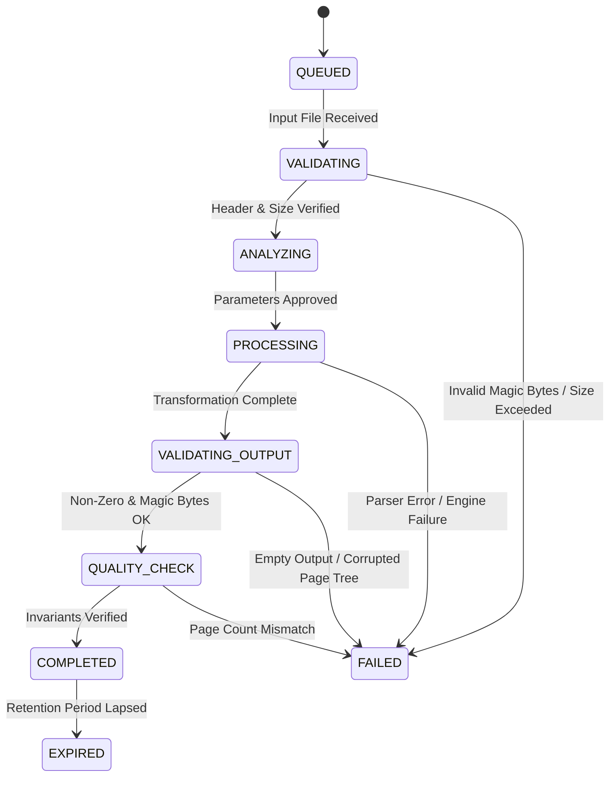

# PDFBolt Enterprise Architecture & Dataflow Specification

## 1. High-Level Architecture Overview

PDFBolt is engineered as a hybrid document intelligence and transformation platform:
- **Client Tier**: High-speed, zero-upload React + TypeScript SPA executing fast client-side operations in WebAssembly/Web Workers.
- **Backend Engine**: A high-throughput, containerized **FastAPI + Python** document processor capable of heavy, multi-profile layout conversions, OCR, structural validation, and adaptive stream compression.

```
                                  USER BROWSER
                                       ↓
                             [ React + TypeScript ]
                                       ↓
                        Reverse Proxy / API Gateway (Nginx)
                                       ↓
                    FastAPI Application Server (/api/v1)
                                       ↓
           ┌───────────────────────────┴───────────────────────────┐
           ↓                                                       ↓
  [ Input Validation ]                                    [ PDF Analyzer ]
   • Magic-byte signature (%PDF-)                          • Page count & image density
   • MIME & size bounds                                    • Font subset inspection
   • Path traversal sanitization                           • Profile recommendation
           ↓                                                       ↓
  [ Universal Job Manager ] ─────────────────────────────→ [ Storage Service ]
   • State machine lifecycle                               • Isolated job directory
   • Raw byte calculations                                 • Expiration cleanup
           ↓
  [ Processing Engine Layer ]
   ├── CompressProcessor (5 profiles + target size + regression trap)
   ├── MergeProcessor & SplitProcessor (Page count invariants)
   ├── Rotate, DeletePages, Watermark, PageNumber, Protect, Unlock
   └── Layout Converters (PDF ↔ DOCX, XLSX, PPTX, Images)
           ↓
  [ Output Integrity Validation ]
   • Non-zero byte verification
   • Binary signature check
   • Page catalog verification (PDFDocument.load)
           ↓
  [ Canonical API Response & Secure Download ]
```

---

## 2. Universal Job Lifecycle State Machine

Every document operation transitions through explicit states:



---

## 3. Directory Layout

```
backend/
├── app/
│   ├── api/v1/          # RESTful v1 Endpoints (jobs, analyze, health)
│   ├── core/            # Security, Error codes, Logging, Metrics
│   ├── models/          # Schemas & Universal Job Model
│   ├── processors/      # Modular Document Transformation Engines
│   ├── services/        # Storage Provider & Job Manager
│   └── validators/      # Binary Magic-byte & Output Integrity Validators
├── storage/             # Isolated job storage (/jobs/{job_id}/input & output)
├── tests/               # Pytest test suite with real PDF fixtures
├── Dockerfile           # Multi-stage production container
└── requirements.txt     # Locked production dependencies
```
